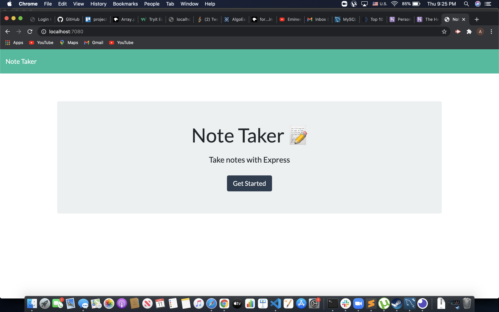
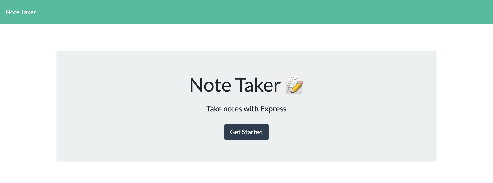

# Note-taker 

   
  This application allows user to take notes and save them into a JSON file. User can add, delete and edit notes. 

   

   [Deployed last version]()

   [Github repo](https://github.com/Amal31497/NoteTaker)

   

  ## Table of Contents 
 
  ##### * [Technologies used](#Technologies)
  ##### * [Usage walkthrough](#Walkthrough)
  ##### * [Installation](#Installation)
  ##### * [Credits](#Credits)
  ##### * [License](#License)
  ##### * [Contact Info](#Contact)

  ## Technologies:
   _*Javascript,Node.js,Heroku App,Others*_

  ## Walkthrough:

  #### Screenshots:
  
  

  ## Installation:
  Run the following commands in your integrated terminal to initalize the application:

    1. git clone [Repository link you can find under "code" button] (To get the code from a repo)
    
    2. npm i

    3. npm install fs

    4. npm install express

    5. npm run watch
  
  ## Credits:
  [w3schools.com](w3schools.com)
  [MDN](MDN)
  

  ## License: 

  ##### Copyright: Amal Janabayev

  ##### 

  ##### [License Link](https://opensource.org/licenses/MIT)

  ## Contact: 

  ##### amalj2426@gmail.com